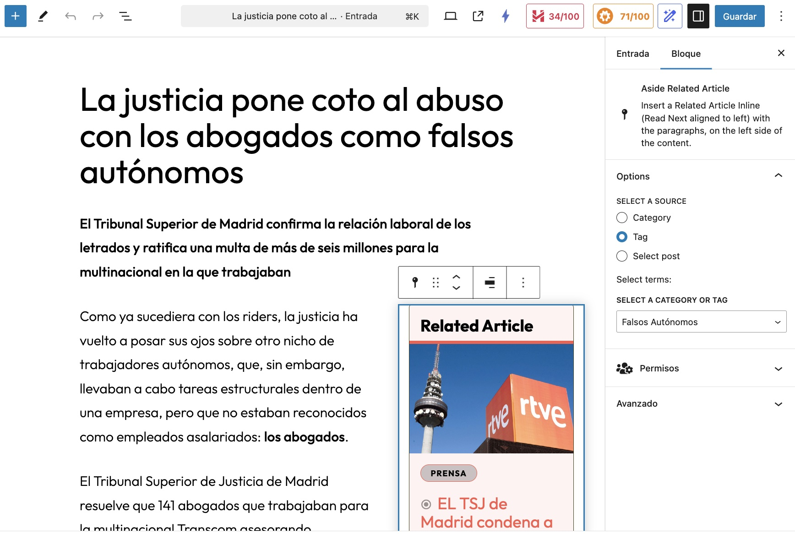
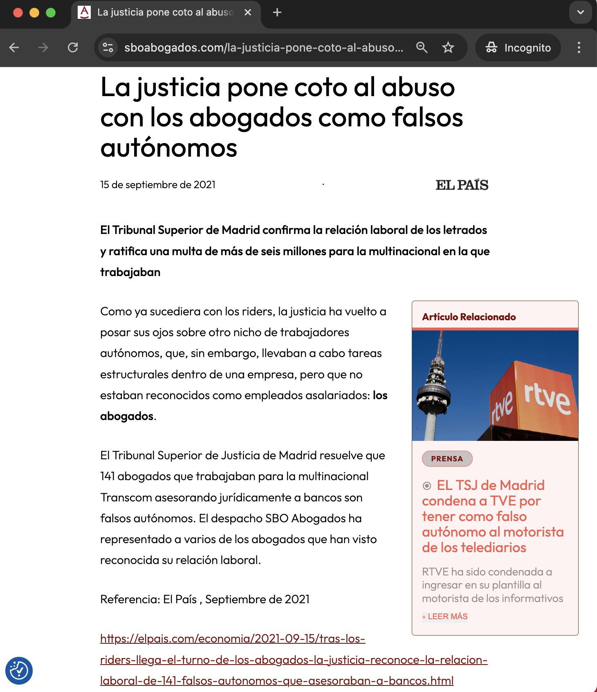

# Summary

## The block in the editor


## The block in the frontend


wp-env / wp-scripts (experimental) / phpunit / playwright / linting (phpcs, phpstan, eslint, stylelint) / browser-sync / github actions for CI

This plugin can be used as a boilerplate to start other plugins with all these configurations.
Read `BOILERPLATE-USE.md`

This plugin creates a block called **Aside Related Article**. When inserted, it shows a widget in one side of the text, floated to the left, with the preview of the related article. You can choose what related article you want to display, or you can let the system find the newsest on the category or tag that you choose (amont the cats and tags associated to the current post).

## Dependencies

- package `@cobianzo/gutenberg-post-lookup-component`

# Start to work:

```
npm i
composer install
npm run start
```

Start environment with
```sh
npm run up (or > npx wp-env start)
```

> [!WARNING]
> In 2025, using a local installation of the package `wp-env` didn't worki for me.  
> It works fine using the global installation of `wp-env`.


you'll see something like this, where the MySQL ports might change.
```
WordPress development site started at http://localhost:8890
WordPress test site started at http://localhost:8891
MySQL is listening on port 49313
MySQL for automated testing is listening on port 49412
```
If the 5mins WordPress installation is triggered, see below **Troubles**.

Inside the docker container the MySQL ports are the regular 3306 and 3307 for testing. They are just mapped out.

the password for MySQL inside the wp-env docker container is 'password', for the user 'root'

You can use terminal commands in the wp-env with the wp-env cli commands:

`npx wp-env run cli wp option get siteurl` or `npx wp-env run cli -- wp option get siteurl`

> you can use `npm run wp-env ...` instead of `npx wp-env run ...`


or if you want to actually get inside the docker container and work locally, you will run  
(note: use `tests-cli` instead of `cli` for the docker containers of the tests environment)

`npm run wp-env run cli sh -c`

---

You can install the demo sample page with:

Maybe you'll need to run
```
npx wp-env run cli -- wp plugin activate wordpress-importer
npx wp-env run cli -- wp plugin activate aside-related-article-block
```

from here you can create dummy data, see `tests/class-create-dummy-data.php`, or import it with `npx wp-env run cli -- wp import wp-content/plugins/aside-related-article-block/themeunittestdata.wordpress.xml --authors=create`

## Developing

You will normally have one or two terminal windows running:

`npm run start` > uses wp-scripts to compile the block into /build and watch changes.

`npm run browser-sync` > if you want to work on `http://localhost:3000` and have the hot reload.

I suggest to watch the **e2e tests** as you work.  
This can't be done right now in terminal (the watching), but you can do it either using the playwright ui ( `npm run test -- --ui` ) or using the VSCode Playwright Test and activate the watch.

**PHP lint**

Lint your work. In a php file run the `composer lint <name.php>` and `composer format <name.php>` in any file.
Use `composer analyze <name.php>` for deep linting.
From time to time run it for the whole project `composer lint .` and `composer format .`.

**JS lint**

With prettier, your files js and css should format automatically on save
(you shouldnt need to run `npm run lint:js`).

`npm run lint:js` - lints all files (for a reason in my last work it doesnt seem to work)

`npm run lint:css` - lints all files

## Full linting summary: After making changes in js, css and php files

Linting formatting js, css, and php files.

For PHP
```
npm run format
composer lint .
composer analyze <name.php>
(or > npm run lint:php)
composer format .
```

Reccomended VSCode extensions
phpcs, phpcbf, eslint, stylelint, prettier

---

# PHPUNIT

- read `tests/readme-how-to-test.md`

it works, I copied it from the create-block-theme plugin, with some adaptations because this is a theme not a plugin.  
The file `bin/install-wp-tests.sh` is not used.

It's not really needed for this simple plugin, where there are no php functionalities or APIs on itself.  
You can run it individually or with watch

`npm run test:php`

`npm run test:php:watch`

# Playwright e2e tests

- read `tests/readme-how-to-test.md`: You'll find tips about how to test. There is an e2e test with dummy data.

`❯ npx playwright test --ui`

 or

 `npm run test:js`
- read `tests/readme-how-to-test.md`

 # Deploy the .zip plugin and upgrade plugin version

We have included a git action to create a downloadbe zip of the plugin for 30 days after every push 
in the `main` branch, but you can create 

`node .github/scripts/build-plugin.js`

will create `dist/aside-related-article-block-1.5.0.zip` using the version from the comment in `aside-related-article-block.php`, ready for distribution. (see more in ./bin/readme-bin.md)

# Continous Integration/ Development

There are Playwright tests, but still not integrated in the Pull Requests.  

We have a good linting exectued on every commit (js/css/phpcs).  

In a Pull Request, we execute the linting again, and also the PHPUnit tests.

In a merge, we execute the automatic version increase. By default we increase it as a patch (from x.y.2 to x.y.3).  
We can increase a minor and major version update by including in the merge commit: `[minor update]`/`[major update]`

# Hooks

If you use this block as a developer and you want to customize it, check the filters in `src/blocks/aside-related-article/render.php`. You will be able to overwrite the default texts and images.

```
apply_filters( 'coco_relatedarticle_days_range', $days_range, $parent_post_id );
apply_filters( 'coco_relatedarticle_image_src', $image_src, $the_post, $parent_post_id );
apply_filters( 'coco_relatedarticle_header', $header, $the_post, $parent_post_id );
apply_filters( 'coco_relatedarticle_pre_headline', $pre_headline, $the_post, $parent_post_id );
apply_filters( 'coco_relatedarticle_read_more', __( 'read more', 'aside-related-article-block' ), $the_post, $parent_post_id );
apply_filters( 'coco_relatedarticle_excerpt', $the_excerpt, $the_post, $parent_post_id );
apply_filters( 'coco_relatedarticle_classes', $container_classes, $the_post, $parent_post_id, $attributes );
```

# Troubles

- sometimes the enviroment of wp-env gets crazy and tries to find the assets of the block in :
http://localhost:8890/wp-content/themes/default/var/www/html/wp-content/plugins/aside-related-article-block/build/blocks/aside-related-article/style-index.css?ver=1.0
	- I still don't know why it happens and how to fix it. I restart docker and push the env up again to fix it.

- Sometimes when creating the wp-env, the DB is not initialized. You can use wp cli to help
```
npx wp-env run cli wp db reset --yes
npx wp-env run cli wp core install --url="http://localhost:8890" --title="Mi Sitio WP" --admin_user="admin" --admin_password="password" --admin_email="admin@example.com"
npx wp-env run cli wp plugin activate aside-related-article-block
```

Same for test environment
```
npx wp-env run tests-cli wp db reset --yes
npx wp-env run tests-cli wp core install --url="http://localhost:8891" --title="Mi TEST Sitio WP" --admin_user="admin" --admin_password="password" --admin_email="admin@example.com"
npx wp-env run tests-cli wp plugin activate aside-related-article-block
```


# TODO

- We need CI/CD for Playwright
- Improve the github actions: use cache or artifacts to avoid repeating npm run build etc.
- Move the artifact to an S3 bucket or a repo for the distribution.
- Refactor to typescript
- Transform most of the styles in the css into json styles, with variations.
- Extend the tests for mobile devices and for other wordpress versions/themes
- Localization (translation)
- Add more options to the plugin: hide excerpt, allow editing the header and the read more ...
